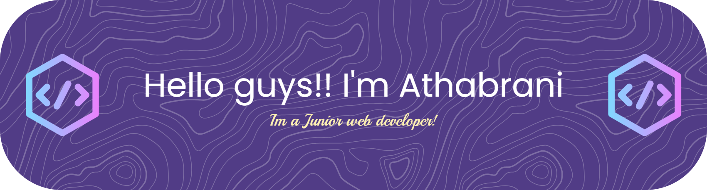

# 👋 Hi there, I'm Athabrani!

 

## 💫 About Me

<fieldset>

* 🔭 I’m currently studying at **SMKI Sahabat Ilmu Karawang**
* 🌱 I’m currently learning **HTML, CSS**, and the basics of **web development**
* 👨‍💻 I enjoy creating **clean, simple, and responsive designs**
* 🏃‍♂️‍➡️ **Fun fact:** I'm a runner
* 😄 **Pronouns:** He/Him
* 💬 **Ask me about:** Web design, student projects, or sports

</fieldset>

## 🌐 Connect With Me

## 🛠️ Skills

  
  
  

## 📊 GitHub Stats

  

  

 

### ✍️ Random Dev Quote

